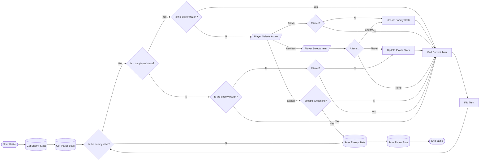

# What is this?

This is the repo for Douglas' and Kris' 2023 SDD Assessment Task 2.

# Planning

## Defining the Solution

Our final goal is to create a completely playable tile-based RPG game using `pygame`. This game will have the following features:

- Open-world Map
- Combat system
- Health system
- Characters
  - Player
  - Monsters
  - NPCs
- Storyline
- Experience and leveling system

In order to achieve a good result with a clean codebase, we will be splitting the game into modules:

- Main Logic (main game behaviour)
- Player (player behaviour)
  - Movement
  - Combat
- Enemies (enemy behaviour)
- NPCs (NPC dialogue, etc.)
- Items (item behaviour)
- Map (map and tiles)
- GUI (everything related to rendering)
- Input and Events
- Utility (small useful functions)

### Steps

- [ ] Construct storyline
- [x] Build basic `pygame` framework
- [ ] Construct Modules
  - [x] Input and Events
  - [x] GUI elements (For now - more elements to be added later)
  - [x] Player Movement
  - [x] Map
  - [x] Enemies
  - [ ] Combat
  - [x] Items
  - [ ] NPCs and Dialogue (If have time)
  - [ ] Utility (Add on the way)
- [ ] Assemble
  - [ ] Lighting system
  - [ ] Actual Maps
    - [ ] Enemies and combat triggers
    - [ ] NPCs (If made)
  - [ ] Menus
  - [ ] Game Progress (Tutorial, boss etc.)

### Possible Problems

| Problems | Solution |
| -------- | -------- |
| Time is limited | Sophisticated Planning |
| One person might do more work | Detailed and appropriate delegation of tasks |

## Planning the Solution

### Combat System Flowchart

## Building the Solution

## Testing the Solution

## Modifying the Solution
